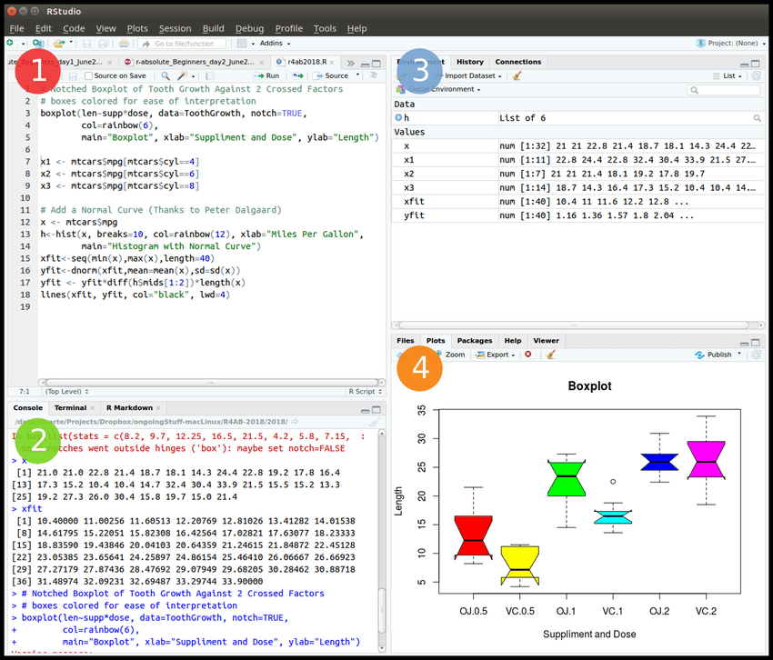
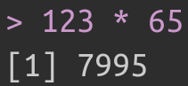

```{r packages_setup, echo=FALSE, message=FALSE, warning=FALSE}
library(tidyverse)
library(NHANES)
knitr::opts_chunk$set(echo = T, warning = F, message = F)
knitr::opts_chunk$set(fig.width=8, fig.height=6) 
```

class: center, middle, inverse, title-slide

<div class="title-logo"></div>

# Análisis y Explotación de la Información

## Tema 1 - Programación en R

### Roi Naveiro


---


## R y RStudio


### ¿Qué es R/RStudio?

- R es un lenguaje de programación especializacido en estadística
- RStudio es una interfaz para programar en R

```{r, echo=FALSE, out.width = '80%',  fig.align='center'}
knitr::include_graphics("img/r-rstudio.png")
```


[Instalación de R y RStudio](https://rstudio-education.github.io/hopr/starting.html)

---

## Interfaz de usuario de R

- RStudio: forma de comunicarse con máquina
- R: lenguaje de comunicación

```{r, echo=FALSE, out.width = '70%',  fig.align='center'}

```
---

## Ejecutar comandos

```{r, echo=TRUE}
123 * 65
```

En consola aparece como

```{r, echo=FALSE, out.width = '20%',  fig.align='center'}

```


```{r, echo=FALSE}
options(width = 60)
```

```{r, echo=TRUE}
1000:1020
```

Uso como calculadora

```{r, echo=TRUE}
(7 + 7) / 7 * 2 
```

---


## Comentarios

* Comentarios con `#`

```{r, echo=TRUE}
# Esto es un comentario
# Sumo los números del 1 al 100
sum(1:100)
```

* Salida de código con `##`

* Comprueba que la siguiente expresión es cierta para $K=100$ y $K=1000$

  $$
  \sum_{i=1}^{K} i = \frac{K \cdot (K + 1)}{2}
  $$
---
## Objetos

* Si queremos un valor (o conjunto de valores) de forma recurrente hay que **guardarlos en memoria**, dándole un nombre.

```{r, echo=TRUE}
# Esto crea un objeto de R con valor pi
a <- pi

# Sumo 3 al valor guardado
a + 3
```

* Podemos guardar múltiples valores

```{r, echo=TRUE}
b <-1:10
b
```

---
## Objetos

Los objetos guardados aparecen en la ventana de *Environment*

```{r, echo=FALSE, out.width = '100%',  fig.align='center'}
knitr::include_graphics("img/env.png")
```

El nombre de un ojeto no puede empezar con un número, ni tampoco incluír ciertos caracteres especiales como `^`, `$`, `@`, etc.

---
## Objetos

R sobre-escribe

```{r, echo=TRUE}
c <- 5
c

c <- 20
c
```

La función `ls()` muestra nombres usados

```{r, echo=TRUE}
ls()
```

---
## Operaciones sobre objetos

* R realiza operaciones *element-wise*

* Vector - Número
```{r, echo=TRUE}
b <- 1:10
b + 7
```

* Vector - Vector (misma longitud)
```{r, echo=TRUE}
b * b
```

---
## Operaciones sobre objetos

* Vector - Vector (diferente longitud)

```{r, echo=TRUE}
# R repite el vector corto hasta alcanzar la longitud del largo
# Si la longitud del corto no es múltiplo de la del largo lanza un warning
d <- 1:2
e <- 1:4

d * e
```

¡Pruébalo!

---
## Funciones

R tiene muchas funciones predefinidas 
```{r, echo=TRUE}
# Calcula la media de los números del 1 al 10
mean(1:10)

# El argumento de una función puede ser el resultado de otra función
round(mean(1:10))
```

Algunas funciones tienen varios argumentos. Cada uno tiene un nombre

```{r, echo=TRUE}
# Muestrea un número del 1 al 10
sample(x = 1:10, size = 1)

# Nombre opcional
sample(1:10, 1)
```

---
## Funciones

La función `args()` muestra los argumentos de una función
```{r, echo=TRUE}
args(sample)
```

¡Algunas tienen valores por defecto! 
Pregunta, ¿qué valores tiene por defecto la función `round()`?

**Buena práctica**: escribir nombre de argumentos (salvo quizás el primero).

---
## Definiendo funciones propias

* Permiten definir operaciones de uso recurrente (no implementadas en R).
```{r, echo=TRUE, eval=FALSE}
una_funcion <- function(){}
```

* Función que genera 10 números entre 1 y 100 y devuelva su suma

--

```{r, echo=TRUE}
gen2_1_100 <- function(){
  nums <- sample(1:100, size = 2, replace = TRUE)
  print(nums)
  return(sum(nums))
}
```

* La probamos

```{r, echo=TRUE}
a <- gen2_1_100()
a
```

---
## Definiendo funciones propias

* Argumentos

```{r, echo=TRUE}
# Pasamos el tamaño como argumento
# 2 es el valor por defecto
gen2_1_100 <- function(n=2){
  nums <- sample(1:100, size = n, replace = TRUE)
  print(nums)
  return(sum(nums))
}
```

* La probamos sin argumento

```{r, echo=TRUE}
gen2_1_100()
```

---
## Definiendo funciones propias

* La probamos con argumento
```{r, echo=TRUE}
gen2_1_100(10)
```

---
## Ejercicio 1

Escribe una función que devuelva $k$ números, donde cada número es
la suma de $n$ números escogidos al azar entre 1 y 100 (con reemplazamiento), divido entre n.

Pinta un histograma con los resultados de $k=10000$ para $n=1$, $n=2$, $n=10$ y $n=100$.
Pista: puedes usar la función `hist()`.

¿Qué observas?

---
## Instalar paquetes

## Recursos Interesantes

* [Análisis de datos acerca de la evolución de las tendencias musicales](https://towardsdatascience.com/billboard-hot-100-analytics-using-data-to-understand-the-shift-in-popular-music-in-the-last-60-ac3919d39b49)

* [A year as told by FitBit](https://livefreeordichotomize.com/2017/12/27/a-year-as-told-by-fitbit/)

* [Charla TED](https://www.youtube.com/watch?v=hVimVzgtD6w)

---

## Bibliografía

* [Hands-On Programming with R](https://rstudio-education.github.io/hopr/), Grolemund (2014)

* [R for Data Science](https://r4ds.had.co.nz/), Wickham and Grolemund (2016)

* [Data Visualization, A practical introduction](https://socviz.co/), Healy (2018)

* [Data Science Specialization](https://github.com/DataScienceSpecialization/courses), Johns Hopkins University, Coursera

