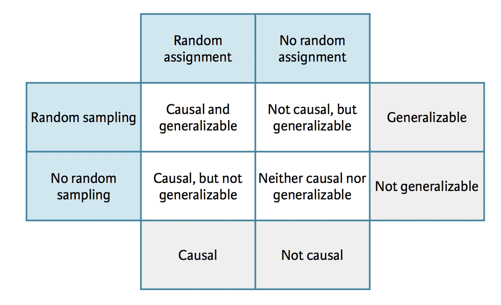
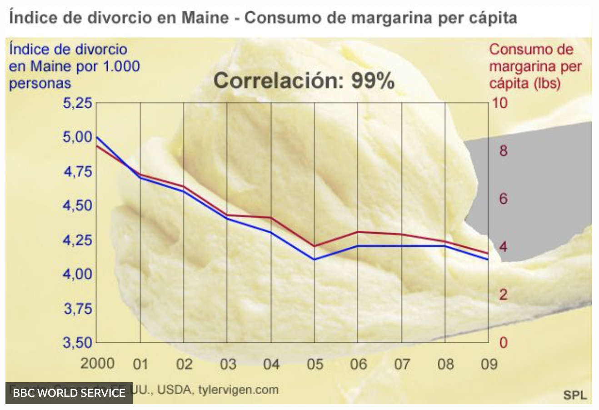
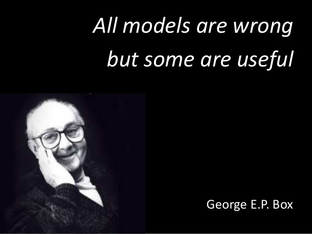

```{r packages_setup, echo=FALSE, message=FALSE, warning=FALSE}
knitr::opts_chunk$set(echo = T, warning = F, message = F)
knitr::opts_chunk$set(fig.width=8, fig.height=6) 
```

class: center, middle, inverse, title-slide

<div class="title-logo"></div>

# Análisis de Datos
 
## Tema 4 - Modelización

<br>
<br>
.pull-left[
### Roi Naveiro
]
---
## Modelización

Las herramientas de modelización tienen cuatro objetivos fundamentales:

* **Explorar** los datos: los modelos a veces revelan patrones que no son evidentes en
las visualizaciónes (>3D)

* **Generalizar** hallazgos de una muestra a la población (inferencia)

* Determinar **relaciones causa-efecto** (inferencia causal)


```{r, echo=FALSE, out.width = '100%',  fig.align='center'}
knitr::include_graphics("img/data-science-model.png")
library(tidyverse)
```

---
## Modelización

Los patrones descubiertos por las herramientas de modelización pueden ser:

* Patrones de asociación
* Relaciones causa-efecto

Además, estos patrones pueden:

* Darse únicamente en los datos observados
* Generalizarse a la población 

---
## Modelización

La forma de recolectar los datos afecta al tipo de generalización de las 
conclusiones:

* Si queremos que las conclusiones extraídas a partir de una muestra de datos
sean generalizables a la población, debemos muestrear los sujetos **al azar**.

```{r, echo=FALSE, out.width = '100%',  fig.align='center'}

```

[Fuente](https://www.huffingtonpost.es/2016/03/28/troleo-en-la-red-para-bautizar-blas-de-lezo-a-un-buque-brita_n_9556114.html)

---
## Modelización

¿Muestrear datos al azar nos garantiza que los patrones detectados sean relaciones 
causa-efecto reales?

---
## Study: Cereal Keeps Girls Slim
 
Se observó que las mujeres que desayunaban tenían un **índice de masa corporal promedio más bajo**, un indicador común de obesidad, que las que no desayunaban. El índice fue aún más bajo para las que **desayunaban cereales**, según los hallazgos del estudio realizado por el Instituto de Investigación Médica de Maryland con fondos de NIH y el fabricante de cereales General Mills.

[...]

Los resultados se obtuvieron de una encuesta de NIH de 2379 mujeres en California, Ohio y Maryland.

[...]

Como parte de la encuesta, se preguntaba a las niñas una vez al año qué habían comido durante los tres días anteriores...

[Fuente](https://www.cbsnews.com/news/study-cereal-keeps-girls-slim/)

---
## Study: Cereal Keeps Girls Slim

Existen tres posibles explicaciones de este hallazgo:

* Comer cereales es la causa de que las mujeres estén delgadas

* Que las mujeres estén delgadas es la causa de que coman cerales

* Existe una tercera variable que es causa de estas dos, **variable de confusión**

Una **variable de confusión** es una variable exógena que es causa tanto a la variable explicativa como a la de respuesta, y que hace que parezca que existe una relación entre ellas.

---
## Study: Cereal Keeps Girls Slim

"Aquellos que desayunan regularmente tienen **más probabilidades de tener un plan de alimentación estructurado** a lo largo del día y, en consecuencia, es menos probable que coman entre comidas y consuman calorías vacías".

---
## Study: Cereal Keeps Girls Slim

¿Por qué se publica esto?

```{r, echo=FALSE, out.width = '100%',  fig.align='center'}

```

---
## Estudios científicos

Según el proceso de recolección de los datos, distinguimos estudios:

* **Observacionales**

  * Se recogen datos de forma que no se altera el proceso de generación de los mismos

  * Sirven para determinar **asociación**

* **Experimentales**

  * Se asignan diferentes tratamientos a distintos individuos 

  * Establecer relaciones **causa-efecto**

---
## Estudios científicos

```{r, echo=FALSE, out.width = '100%',  fig.align='center'}

```

---
## Correlación no implica necesariamente causalidad

```{r, echo=FALSE, out.width = '90%',  fig.align='center'}

```

---
## Modelización

Las herramientas de modelización tienen cuatro objetivos fundamentales:

* **Explorar** los datos: los modelos a veces revelan patrones que no son evidentes en
las visualizaciónes (>3D)

* **Generalizar** hallazgos de una muestra a la población (inferencia)

* Determinar **relaciones causa-efecto** (inferencia causal)

```{r, echo=FALSE, out.width = '100%',  fig.align='center'}
knitr::include_graphics("img/data-science-model.png")
```

---
## Modelización

* En lo que resta de curso, introduciremos herramientas básicas de modelización, poniendo
el foco en su uso como **técnicas de exploración** de datos.

* **No** vamos a estudiar cómo usar estas herramientas para generalizar resultados a poblaciones, ni para determinar causalidad.

* No hay nada malo con la exploración, pero nunca debes vender un análisis exploratorio como un análisis confirmatorio porque es **engañoso**.

---
class: center, middle, inverse

# Elementos básicos de los modelos

---
## ¿Qué son los modelos?

* Herramientas que nos permiten extraer patrones de los datos.

* Patrones vs residuos

* Estudiaremos modelos que relacionan un serie de variables (variables predictoras)
coon una variable de interés (variable respuesta)

---
## ¿Qué son los modelos?

* Representamos estas relaciones como **funciones**

* Una función mapea unos inputs a un output

* Esta función tiene input $x$ y output $y$
$$
y = 3x + 7
$$

---
## ¿Qué son los modelos?

```{r}
ggplot(mtcars, aes(x=wt, y=mpg)) + geom_point() + theme_minimal() +
  geom_smooth(method="lm", se=FALSE, color='red')
```

---
## ¿Qué son los modelos?

Distinguimos elementos importantes

* **Familia de modelos**: definen el patrón que queremos capturar. Por ejemplo:
la familia de modelos lineales que relacionan $x$ con $y$ es:

$$
y = \beta_0 + \beta_1 x
$$

* **Modelo ajustado**: aquel dentro de la familia que mejor reproduce los datos observados

**OJO**: el mejor modelo de la familia no tiene por qué ser la realidad. Los modelos son
simplificaciones de la realidad que nos sirven de algún propósito

---
## ¿Qué son los modelos?

```{r, echo=FALSE, out.width = '100%',  fig.align='center'}

```

---
## Vocabulario

* **Variable respuesta**: Variable cuyo comportamiento o variación se está tratando de entender. También llamada variable dependiente. Eje y.

* **Variables explicativas**: otras variables que desea utilizar para explicar la variación en la respuesta. También llamadas variables independientes, covariables, predictores o *features*. Eje x.

* **Valor predicho**: output del modelo para cierto valor de las covariables.

---
## Vocabulario

Discute los elementos anteriores en este ejemplo.

```{r}
ggplot(mtcars, aes(x=wt, y=mpg)) + geom_point() + theme_minimal() +
  geom_smooth(method="lm", se=FALSE, color='red')
```

---
## Ajustando modelos

```{r}
ggplot(mtcars, aes(x=wt, y=mpg)) + geom_point() + theme_minimal()
```

---
## Ajustando modelos

* Los datos anteriores presentan un patrón claro

* Usaremos un modelo para capturar ese patrón y hacerlo explícito

* Un modelo lineal parece razonable $y = \beta_0 + \beta_1 x$

* Existen infinitos modelos en esta familia

---
## Ajustando modelos

```{r}
models <- tibble(
  a1 = runif(250, -20, 40),
  a2 = runif(250, -5, 5)
)

ggplot(mtcars, aes(wt, mpg)) + 
  geom_abline(aes(intercept = a1, slope = a2), data = models, alpha = 1/4) +
  geom_point() + theme_minimal()
```

---
## Ajustando modelos

* La mayoría de estos modelos son **malos**, no capturan el patrón

* Necesitamos determinar qué modelos son **más cercanos** a los datos

* Una opción, usar el modelo que minimice suma de las distancias verticales de cada
punto a la recta del modelo

---
## Ajustando modelos

```{r, echo=F}
fit <- lm(mpg ~ wt, data = mtcars)
mtcars[,"predicted"] <- predict(fit)

ggplot(mtcars, aes(wt, mpg)) + geom_smooth(method="lm", se=F, color="red") +
  geom_segment(aes(xend = wt, yend = predicted), alpha = .2) +  # alpha 
  geom_point() + theme_minimal()
```

---
## Regresión lineal

Este modelo se conoce como regresión lineal. Para obtener el valor de los coeficientes 
usando R, hacemos

```{r}
reg_mod <- lm(mpg ~ wt, data = mtcars)
coef(reg_mod)
```

* Intercept es la estimación del coeficiente $\beta_0$ y wt la de $\beta_1$

---
## Regresión lineal

La regresión lineal es un modelo estadístico de la relación entre un predictor $x$
y una variable respuesta cuantitativa $y$ cuando esta relación es lineal con cierto
error $\epsilon$

$$
y = \beta_0 + \beta_1 x + \epsilon
$$

En este curso no hablaremos mucho del error $\epsilon$ pero recuerda que siempre existe.

---
## Regresión lineal

* Para estimar los valores de $\beta_0$ y $\beta_1$, usamos los datos.

* Llamamos a las estimaciones $b_0$ y $b_1$ y $\hat{y} = b_0 + b_1 x$.

* $b_0$ y $b_1$ son aquellos valores que hacen que las distancias verticales vistas anteriormente sean mínimas.

---
## Regresión lineal - Residuos

Los residuos nos dicen cómo de lejos está cada valor predicho de su valore observado

Residuo = Valor observado - valor predicho: $y - \hat{y}$

---
## Visualización de modelos

Podemos visualizar:

* Las predicciones de los modelos

* Los residuos de los modelos

Para esto, utilizamos `modelr` de `tidyverse`

---
## Visualización de modelos

* Primero creamos una red de puntos de la variable predictora

```{r}
library(modelr)
grid <- mtcars %>% 
  data_grid(wt) 

grid
```

---
## Visualización de modelos

* Con el modelo, podemos añadir predicciones

```{r}
reg_mod <- lm(mpg ~ wt, data = mtcars)

grid <- grid %>% 
  add_predictions(reg_mod)

grid
```

---
## Visualización de modelos

```{r}
ggplot(mtcars, aes(wt)) +
  geom_point(aes(y = mpg)) + theme_minimal() +
  geom_line(aes(y = pred), data = grid, colour = "red", size = 1)
```


---
## Visualización de modelos

Añadimos residuos usando

```{r}
reg_mod <- lm(mpg ~ wt, data = mtcars)

mtcars <- mtcars %>% add_residuals(reg_mod)
```

---
## Visualización de modelos

```{r}
ggplot(mtcars, aes(wt, resid)) + 
  geom_ref_line(h = 0) +
  geom_point() 
```

---
## Visualización de modelos

* Las predicciones nos dicen qué patrón hemos capturado

* Los residuos indican qué patrón queda sin capturar


---
## Bibliografía

Este tema está fundamentalmente basado en  [R for Data Science](https://r4ds.had.co.nz/), Wickham and Grolemund (2016)